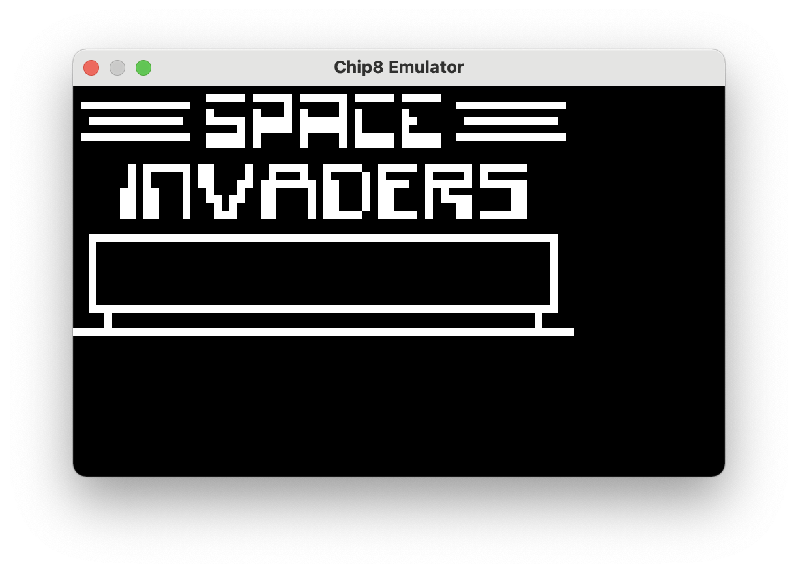
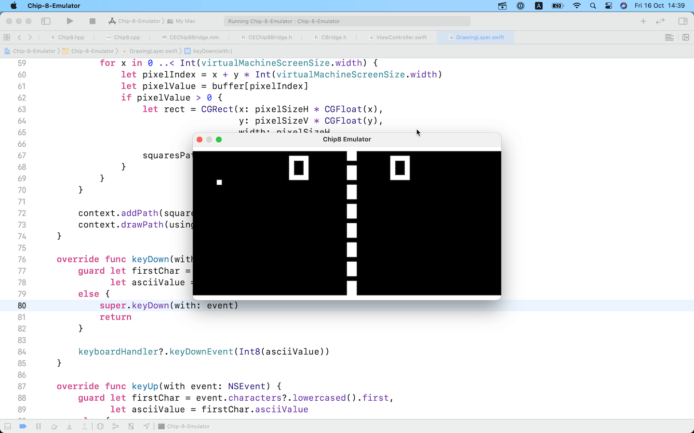

# Chip 8 Emulator

**Disclaimer:** this is still a WIP that I'm building in my spare time.

While I'm getting interested in the theory behind emulators, I thought it would be fun to try writing a very simple emulator: Chip-8.

Chip-8 is an interpreted programming language from the 1970s. It ran on the COSMAC VIP, and supported many programs such as Pac-Man, Pong, Space Invaders, and Tetris.
The Chip-8 specification requires the use of sixteen 8-bit registers (V0-VF), a 16-bit index register, a 64-byte stack with 8-bit stack pointer, an 8-bit delay timer, an 8-bit sound timer, a 64x32 bit frame buffer, and a 16-bit program counter. The Chip8 specification also supported 4096 bytes of addressable memory. All of the supported programs will start at memory location 0x200. All setting of pixels on the display are done through the use of sprites, which are also used for building a small font set. The architecture handles a 16-key keyboard (0 − 9, A − F). 

For details on the specs:
https://en.wikipedia.org/wiki/CHIP-8

### Implementation and Goals

The core of the emulator is written in C++, while the UI is aimed to be written in Swift (perhaps leveraging CALayer and/or Core Graphics). That's the idea at the moment.

Because of the odd couple (C++/Swift), some boilerplate code is needed in order allow exchanging data and messaging objects from the two languages. While Objective-C doesn't allow mixing with C++, Objective-C++ does. That's why the project ends up being a mix of C++, Objective-C, Objective-C++ and Swift.

Normally you wouldn't want to do that because of the bridging complications that are involved, and because this can potentially force you to use "unsafe" Swift for accessing C/C++ data structures. However, this is meant to be a learning project about emulators, but also a playground for brushing up my C++ and Swift interoperability skills. Perhaps this is what makes this fun :-)

Eventually I will be able to load ROM files (mostly little games), have them displayed on a window, plus some basic interactions using the small keyboard set.

### Latest screenshots

<table>
<tr>
    <td></td>
    <td></td>
    <td></td>
</tr>
</table>

### Progress

**[16/10/20]** 
- Virtual machine rendering now uses the entire window space, constrained to 2:1 ratio
- Machine is not started when ROM image is not found. An alert is also displayed
- Made possible to disable debug console logs

**[15/10/20]** Fixed issue in 0x8xy5 instruction, so now the ball in pong bounce back correctly! :-)

**[14/10/20]** Keyboard events are now forwarded and handled and somehow I can play! However there might be an issue with program jumps or with collision detection as the ball almost always doesn't bounce back :-(

**[11/10/20]** Implemented a basic timer to allow programs to continue. No keyboard interactions possible yet, but this will come soon!

**[01/10/20]** Got drawing instruction working correctly!
