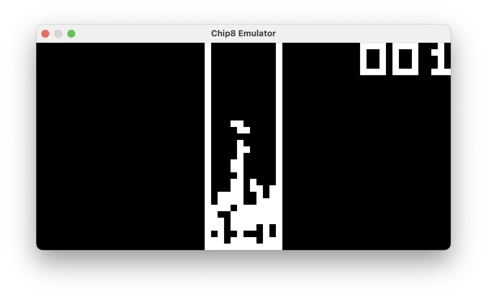
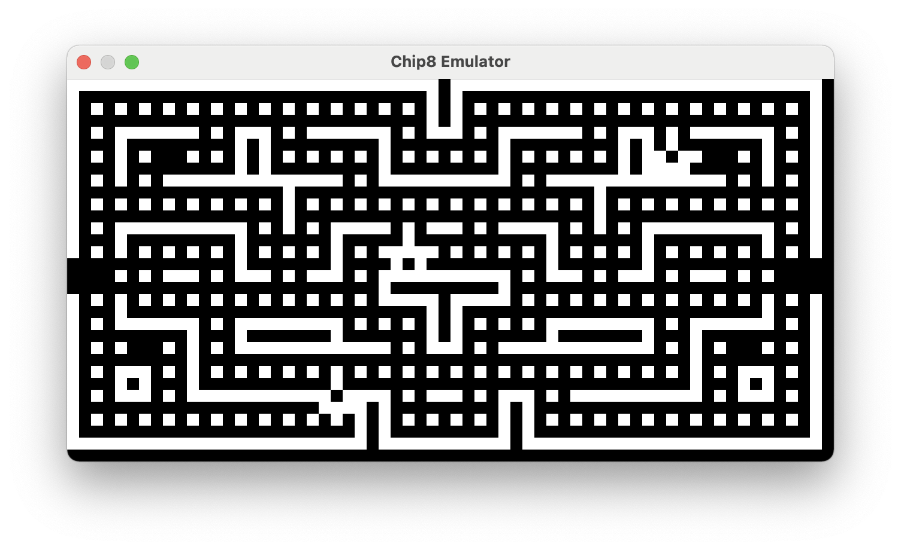
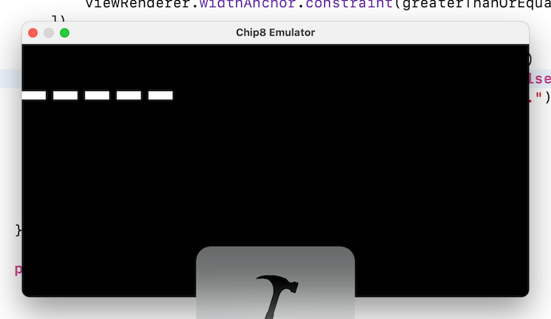

# Chip-8 Emulator

A small emulator for the Chip-8 programming language, written for macOS in C/C++ and Swift.

### What is Chip-8?

Chip-8 is an interpreted programming language from the 70s. It ran on the COSMAC VIP and later on others similar architectures, and supported many programs such as Pac-Man, Pong, Space Invaders, and Tetris. The details on the specifications today can be easily found online from many sources; please find some references below.

Here is just a short description of its specs:
- Supported 4096 Bytes of addressable memory, with programs starting at memory location 0x200
- It had sixteen 8-bit registers (V0-VF), plus a 16-bit index register
- 64-Byte stack with 8-Bit stack pointer
- 8-Bit delay timer
- 8-Bit sound timer
- An exciting 64x32 Bits frame buffer! All setting of pixels on the display were done through the use of sprites, 8 bits wide but height could be variable
- Sprites were also used for displaying a very small font set (0-9, A-F)... Yes, the hexadecimal numbers!
- It also handled a 16-key keyboard, for the same keys available in the font set
- Program counter was a 16-bit value

### Motivations

I grew up in the middle of the 70s and by the time I was about 10, the computer-games revolution was on fire! I have been lucky to see and use machines such as the [Atari 2600](https://en.wikipedia.org/wiki/Atari_2600), the Commodore 16, the Plus 4 and of course the glorious [Commodore 64](https://en.wikipedia.org/wiki/Commodore_64), which I owned and I still own. Despite playing a lot of games with friends at young age, for some reasons I never became very passionate about games. I was instead very intrigued by programming and by how all of this worked. On my Commodore 64 I ran out of memory writing programs with Basic quite often (ok, not a difficult task you may say).

Today almost any kind of retro game or architecture that you can think of, can be easily brought back to life with emulators; and it's impressive to see all these tiny (and less tiny) games and programs now running on any kind of device, as if they were running on the original machine!

These "old times" of the computer, undeniably, were just amazing!... But programming for those machines was also so much challenging on one way. Things that today software engineers can take almost for granted (such as availability of memory and CPU resources, abstract languages etc), are now partially hidden by the advancements made in decades of improvements on hardware and software. Of course today we have different challenges and different things to worry about when writing programs, but that's what makes developing software so much exciting... Hopefully!

There is so much to learn from the early languages and from computers architectures, and I think writing an emulator is a nice and exciting way to go deeper into many low-level details. Plus, it's about connecting the "old" with the "new", which sounds exciting to me.

That being said there are already several implementations of Chip-8 around written in different languages. In here I wanted to focus on understanding how C/C++ can interface with Swift and Objective-C, and use the "retro" excitement as a propeller for building it :-)

### Implementation

The core of the emulator is written in C/C++, while the UI is written in Swift.

Because of the odd couple (C++/Swift), some boilerplate code is needed in order to allow exchanging data and messaging objects from the two languages. While Objective-C doesn't allow mixing with C++, Objective-C++ does. That's why the project ends up being a mix of C++, Objective-C, Objective-C++ and Swift.

Normally you wouldn't want to do that because of the bridging complications that are involved, and because this can potentially force you to use "unsafe" Swift for accessing C/C++ data structures. However, this is meant to be a learning project about emulators, but also a playground for brushing up my C++ and Swift interoperability skills.

Drawing the buffer is currently implemented by simply drawing with CoreGraphics big pixels, but I may change my mind at some point. 

### Building and running

It's a regular macOS app built with latest Xcode (at the time of writing version 12.1).
There are no external dependencies and the project right now is very small, so you should be able to build and run it easily.
In case you run into any build issue I'm happy to know about it.

### Loading and playing with a specific ROM

Right now ROM files can only be selected from the application bundle, and you can only play with 1 ROM per run.
The name of the ROM to load is currently hardcoded in `ViewController.swift`, in order to load a different ROM:
- Open `ViewController.swift`
- Replace `loadRom(withName: "brix")...bla bla` with one of the others ROMs that you find under ROMS/ folder 

This is a bit annoying. Eventually I want to be able to open any external ROMs simply by selecting a file.

It can be difficult to get which keyboard key to use for which game, so you may want to try first the following ROMs:
- _brix_: Use 4-6 to move left-right
- _15puzzle_: Press the corresponding number or letter you want to move. Easy
- _pong2_: 1-4 to move one pad, d-c for the other

### Known issues
- Some games get stuck after a while
- Reproduction speed sometimes feels too fast or too slow depending on the ROM loaded
- Occasional crashes

### Future improvements
- Right now I'm just using a delay between each instruction, which isn't great
- Perhaps better drawing performance
- Why some games get stuck?

### Specifications and others useful resourses

The specifications that I've followed the most for this implementation are available on Wikipedia: https://en.wikipedia.org/wiki/CHIP-8

You can then find several others resources online, which more or less mirror the content from Wikipedia, but sometimes you also find more interesting details and historical documents, such as this article from ETI (Electronics Today International), dated 1981! https://archive.org/stream/ETIA1981/ETI%201981-11%20November#page/n113/mode/2up
or this other one from Byte magazine from 1978! https://archive.org/details/byte-magazine-1978-12/page/n109/mode/2up (from page 110)

You can find many more links on Wikipedia.

### Screenshots

<table>
<tr>
    <td></td>
    <td></td>
    <td></td>
</tr>
<tr>
    <td></td>
    <td></td>
    <td></td>
</tr>
<tr>
    <td></td>
    <td></td>
    <td></td>
</tr>
</table>

### Progress

**[23/10/20]** Added more roms and small code polishing
**[16/10/20]** 
- Virtual machine rendering now uses the entire window space, constrained to 2:1 ratio
- Machine is not started when ROM image is not found. An alert is also displayed
- Made possible to disable debug console logs

**[15/10/20]** Fixed issue in 0x8xy5 instruction, so now the ball in pong bounce back correctly! :-)

**[14/10/20]** Keyboard events are now forwarded and handled and somehow I can play! However there might be an issue with program jumps or with collision detection as the ball almost always doesn't bounce back :-(

**[11/10/20]** Implemented a basic timer to allow programs to continue. No keyboard interactions possible yet, but this will come soon!

**[01/10/20]** Got drawing instruction working correctly!
