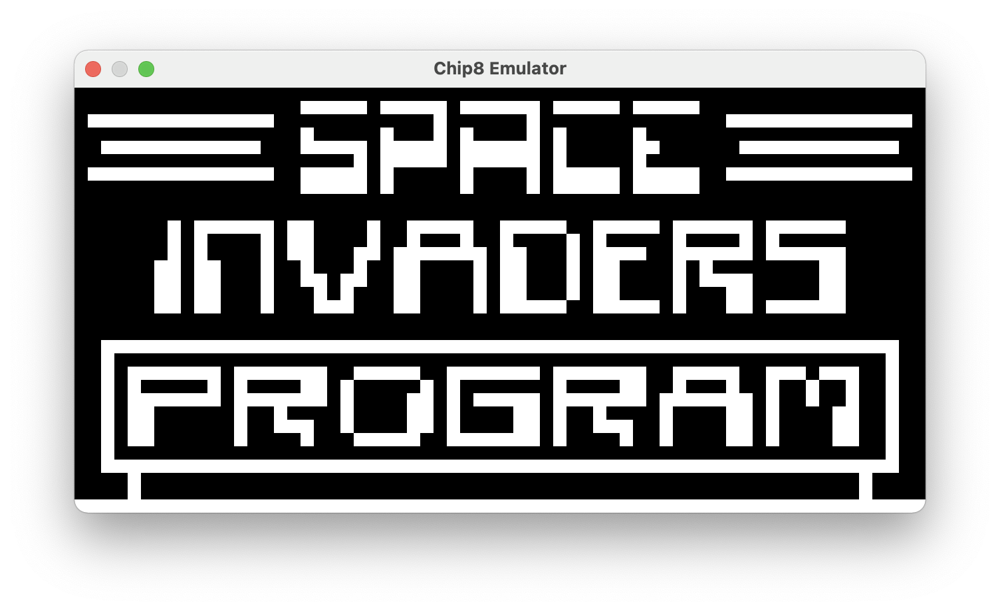

# Chip 8 Emulator

Chip-8 is an interpreted programming language from the 70s. It ran on the COSMAC VIP, and supported many programs such as Pac-Man, Pong, Space Invaders, and Tetris. The details on the specifications today can be easily found online from many sources; please find some links below.

Here is just a short description of its specs:
- Supported 4096 Bytes of addressable memory, with programs starting at memory location 0x200
- It had sixteen 8-bit registers (V0-VF), plus a 16-bit index register
- 64-Byte stack with 8-Bit stack pointer
- 8-Bit delay timer
- 8-Bit sound timer
- An exciting 64x32 Bits frame buffer! All setting of pixels on the display were done through the use of sprites, which were always 8 bits wide but height could be variable
- Sprites were also used for displaying a very small font set (0-9, A-F)... Yes, the hexadecimal numbers!
- It also handled a 16-key keyboard, for the same keys available in the font set
- Program counter was a 16-bit value

### Motivations

I grew up in the middle of the 70s and by the time I was about 10, the computer-games revolution was on fire! I have been lucky to see and use machines such as the [Atari 2600](https://en.wikipedia.org/wiki/Atari_2600), the Commodore 16, the Plus 4 and of course the [Commodore 64](https://en.wikipedia.org/wiki/Commodore_64), which I owned and I still own. Despite playing a lot of games with friends, for some reasons I never became very passionate about games. I was instead very intrigued by programming and by how all of this worked. On my Commodore 64 I ran out of memory writing programs with Basic quite often (ok, not a difficult task) but I never fully mastered writing programs in Assembler, which was the best way to take full control of the hardware and build interesting things. 

Today almost any kind of retro game or architecture that you can think of, can be easily brought back to life with emulators; and it's impressive to see all these tiny (and less tiny) games now running on any kind of device as if they were running on the original machine!

TBW...

### Implementation

The core of the emulator is written in C++, while the UI is aimed to be written in Swift (perhaps leveraging CALayer and/or Core Graphics). That's the idea at the moment.

Because of the odd couple (C++/Swift), some boilerplate code is needed in order allow exchanging data and messaging objects from the two languages. While Objective-C doesn't allow mixing with C++, Objective-C++ does. That's why the project ends up being a mix of C++, Objective-C, Objective-C++ and Swift.

Normally you wouldn't want to do that because of the bridging complications that are involved, and because this can potentially force you to use "unsafe" Swift for accessing C/C++ data structures. However, this is meant to be a learning project about emulators, but also a playground for brushing up my C++ and Swift interoperability skills. Perhaps this is what makes this fun :-)

Eventually I will be able to load ROM files (mostly little games), have them displayed on a window, plus some basic interactions using the small keyboard set.

### Specifications and others useful resourses

The specifications that I've followed the most for this implementation are available on Wikipedia: https://en.wikipedia.org/wiki/CHIP-8

You can then find several others resources online, which more or less mirror the content from Wikipedia, but sometimes you also find more interesting details and historical documents, such as this article from ETI (Electronics Today International), dated 1981! https://archive.org/stream/ETIA1981/ETI%201981-11%20November#page/n113/mode/2up

You can find many more links on Wikipedia.

### Latest screenshots

<table>
<tr>
    <td></td>
    <td></td>
    <td></td>
</tr>
</table>

### Progress

**[16/10/20]** 
- Virtual machine rendering now uses the entire window space, constrained to 2:1 ratio
- Machine is not started when ROM image is not found. An alert is also displayed
- Made possible to disable debug console logs

**[15/10/20]** Fixed issue in 0x8xy5 instruction, so now the ball in pong bounce back correctly! :-)

**[14/10/20]** Keyboard events are now forwarded and handled and somehow I can play! However there might be an issue with program jumps or with collision detection as the ball almost always doesn't bounce back :-(

**[11/10/20]** Implemented a basic timer to allow programs to continue. No keyboard interactions possible yet, but this will come soon!

**[01/10/20]** Got drawing instruction working correctly!
